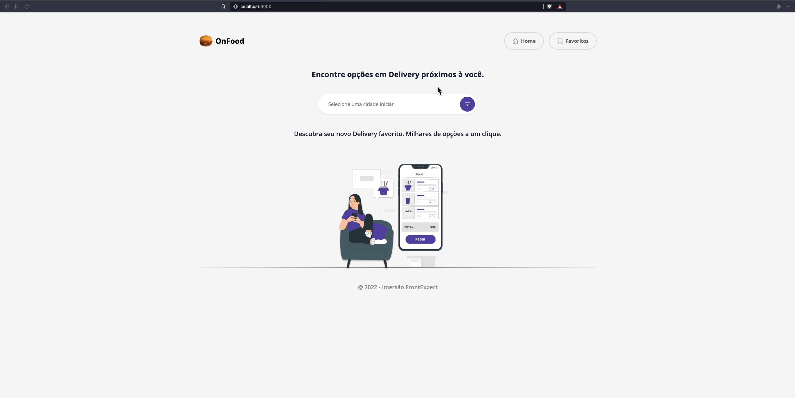

# On Food
Project preview

## Available Scripts

In the project directory, you can run:

### `yarn`
Install the project dependencies.

### `yarn dev`

Runs the app in the development mode.\
Open [http://localhost:3000](http://localhost:3000) to view it in the browser.

The page will reload if you make edits.\
You will also see any lint errors in the console.

## Tech Stack

- [Next.js](https://nextjs.org/)
- [Typescript](https://www.typescriptlang.org/)